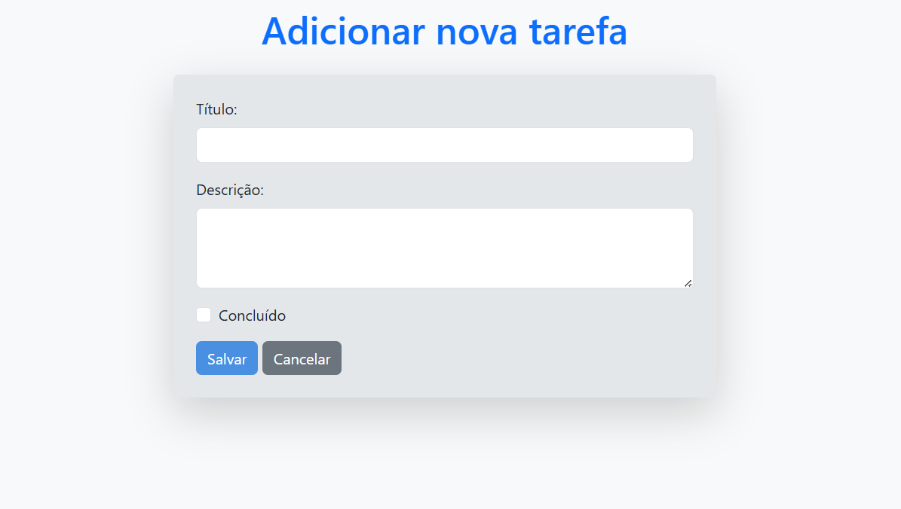
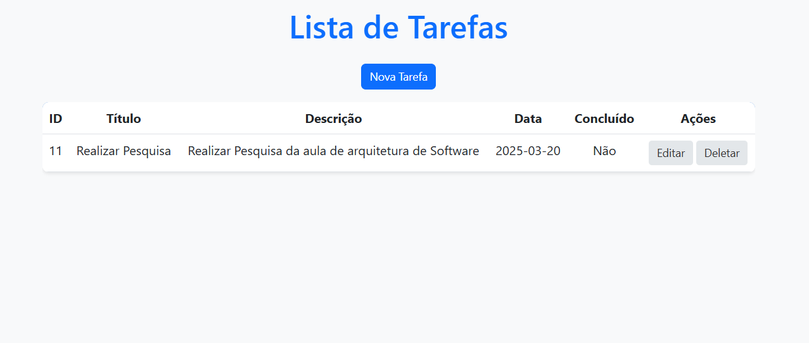

## Projeto acadêmico 
- **Matéria**: Arquitetura de Software
- **Professor**: André Felix Freitas

# Sistema de Gerenciamento de Tarefas

Este é um projeto Java/Spring Boot que implementa um sistema simples de gerenciamento de tarefas. O sistema permite criar, listar, editar e excluir tarefas, além de marcar tarefas como concluídas.

## formulário para adicionar tarefas:

## Lista de tarefas:

# Diagrama de Classes

## Tecnologias Utilizadas

- **Java**: Linguagem de programação utilizada
- **Spring Boot**: Framework para desenvolvimento de aplicações Java.
- **Spring Data JPA**: Para persistência de dados.
- **Thymeleaf**: Para renderização de templates HTML.
- **Bootstrap**: Para estilização das páginas web.
- **PostgreSQL**: Banco de dados.

## Estrutura do Projeto

O projeto está organizado da seguinte forma:

- **Model**: Contém a entidade `Tarefas` que representa uma tarefa no sistema.
- **Repository**: Interface `TarefasRepository` que estende `JpaRepository` para operações de banco de dados.
- **Service**: Classe `TarefasService` que contém a lógica de negócio para manipulação de tarefas.
- **Controller**: Classe `TarefasController` que gerencia as requisições HTTP e interage com o serviço.
- **Views**: Templates Thymeleaf para as páginas HTML (`lista.html` e `form.html`).

## Padrão de Arquitetura MVC

Este projeto foi desenvolvido utilizando o padrão de arquitetura **MVC (Model-View-Controller)**, que separa a aplicação em três camadas principais: **Model**, **View** e **Controller**.

### 1. **Model (Modelo)**
O **Model** representa a camada de dados e lógica de negócio da aplicação. No projeto, a entidade `Tarefas` é o coração do Model. Ela define a estrutura dos dados que serão armazenados no banco de dados.

- **Onde está no projeto**:
    - Classe `Tarefas` no pacote `com.arquiteturamvc.tarefas.model`.
    - Anotada com `@Entity` para mapear a tabela do banco de dados.
    - Utiliza `@Data` do Lombok para gerar automaticamente getters, setters, toString, etc.
    - Contém atributos como `id`, `titulo`, `descricao`, `data` e `concluido`.

### 2. **View (Visão)**
A **View** é responsável pela interface do usuário (UI). No projeto, as Views são implementadas usando **Thymeleaf**, um mecanismo de templates que permite a renderização de páginas HTML dinâmicas.

- **Onde está no projeto**:
    - Arquivos `lista.html` e `form.html` na pasta `src/main/resources/templates`.
    - Utilizam o Thymeleaf para exibir dados dinâmicos (como a lista de tarefas) e interagir com o Controller.

### 3. **Controller (Controlador)**
O **Controller** atua como intermediário entre a View e o Model. Ele recebe as requisições do usuário (via HTTP), processa essas requisições (usando o Service) e retorna a View apropriada com os dados necessários.

- **Onde está no projeto**:
    - Classe `TarefasController` no pacote `com.arquiteturamvc.tarefas.controller`.
    - Anotada com `@Controller` para indicar que é um controlador Spring MVC.
    - Utiliza `@RequestMapping` para mapear URLs (por exemplo, `/tarefas`).

### 4. **Service (Serviço)**
Embora o Service não seja uma camada oficial do padrão MVC, ele é frequentemente utilizado em aplicações Spring para encapsular a lógica de negócio e manter o Controller enxuto. No projeto, o `TarefasService` é responsável por intermediar a comunicação entre o Controller e o Repository.

- **Onde está no projeto**:
    - Classe `TarefasService` no pacote `com.arquiteturamvc.tarefas.service`.
    - Anotada com `@Service` para indicar que é um componente de serviço.

### 5. **Repository (Repositório)**
O Repository é responsável pela interação direta com o banco de dados. Ele abstrai as operações de persistência e fornece métodos prontos para consultas e manipulação de dados.

- **Onde está no projeto**:
    - Interface `TarefasRepository` no pacote `com.arquiteturamvc.tarefas.repositories`.
    - Estende `JpaRepository` para herdar métodos como `save`, `delete`, `findAll`, etc.

### Fluxo de Funcionamento do MVC no Projeto

1. **Requisição do Usuário**:
    - O usuário acessa uma URL (por exemplo, `/tarefas`).
    - O Spring MVC direciona a requisição para o método apropriado no `TarefasController`.

2. **Processamento no Controller**:
    - O Controller recebe a requisição e chama o `TarefasService` para processar a lógica de negócio.

3. **Interação com o Model**:
    - O Service utiliza o `TarefasRepository` para acessar ou modificar os dados no banco de dados (entidade `Tarefas`).

4. **Retorno da View**:
    - O Controller recebe os dados processados e os envia para a View (`lista.html` ou `form.html`).
    - A View renderiza os dados em HTML e os exibe para o usuário.

## Desenvolvido por : 
- **Samuel Monteiro**